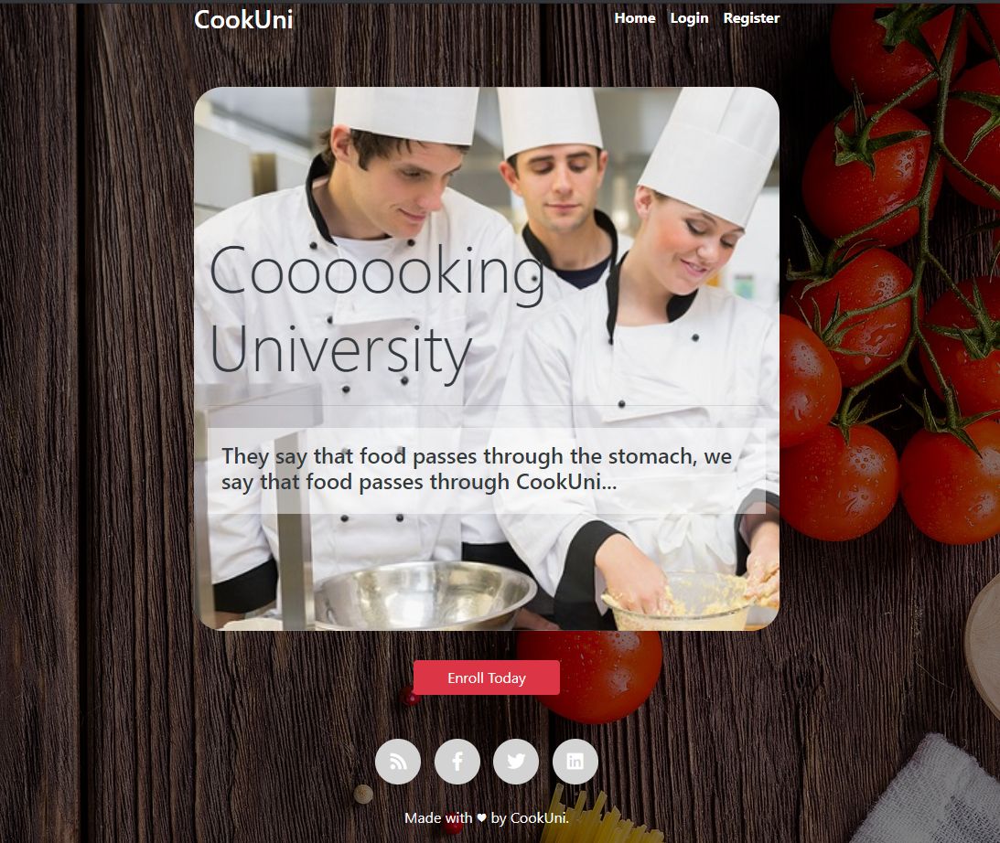

# CookUni Single Page Application

<!-- ABOUT THE PROJECT -->

## About The Project

<p align=”center”>

</p>

Kingsland University - Module 4 - Final Project

Implemented a Web application (SPA) using HTML5, JavaScript, AJAX, and JSON with cloud-based backend (Kinvey). The application should store users and recipes. Users should be able to register, login, logout and view all recipes. They should also be able to create, view, like and archive recipes, depending on their authentication.

### Built With

- [Javascript](https://www.javascript.com/)
- [Sammy](https://sammyjs.org/)
- [HandleBars](https://handlebarsjs.com/)
- [Kinvey](https://www.progress.com/kinvey)

<!-- GETTING STARTED -->

## Getting Started

### Prerequisites

- npm
  ```sh
  npm install npm@latest -g
  ```

### Installation

1. Clone the repo
   ```sh
   git clone https://github.com/your_username_/Project-Name.git
   ```
2. Install NPM packages
   ```sh
   npm install
   ```
3. Run Dev Server
   ```sh
   npm start
   ```

<!-- CONTRIBUTING -->

## Contributing

Contributions are what make the open source community such an amazing place to be learn, inspire, and create. Any contributions you make are **greatly appreciated**.

1. Fork the Project
2. Create your Feature Branch (`git checkout -b feature/AmazingFeature`)
3. Commit your Changes (`git commit -m 'Add some AmazingFeature'`)
4. Push to the Branch (`git push origin feature/AmazingFeature`)
5. Open a Pull Request

<!-- LICENSE -->

## License

Distributed under the MIT License. See `LICENSE` for more information.

<!-- CONTACT -->

## Contact

Your Name - [Jason Schwarz | LinkedIn](https://www.linkedin.com/in/jason-schwarz-75b91482/)

Project Link: [https://github.com/passandscore/CookUni](https://github.com/passandscore/CookUni)
